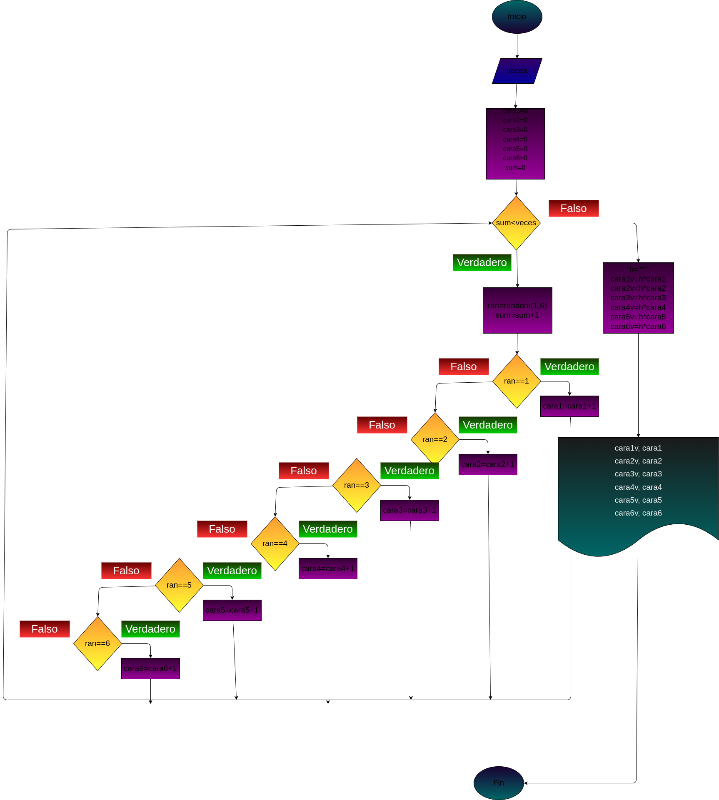

# Bimestral:
## Se requiere un programa en Python para simular el lanzamiento de n dados, realizando la estadística de frecuencias de las veces que cayó cada cara, mediante un "histograma" horizontal:

